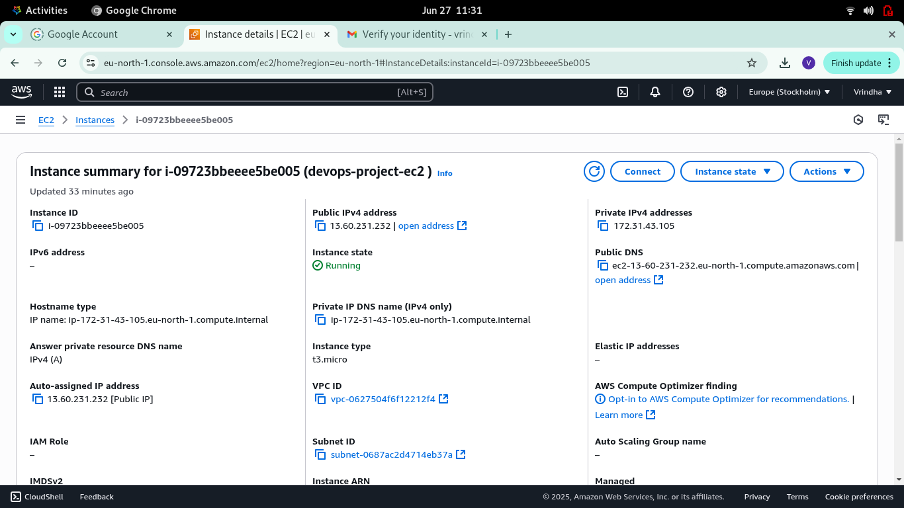
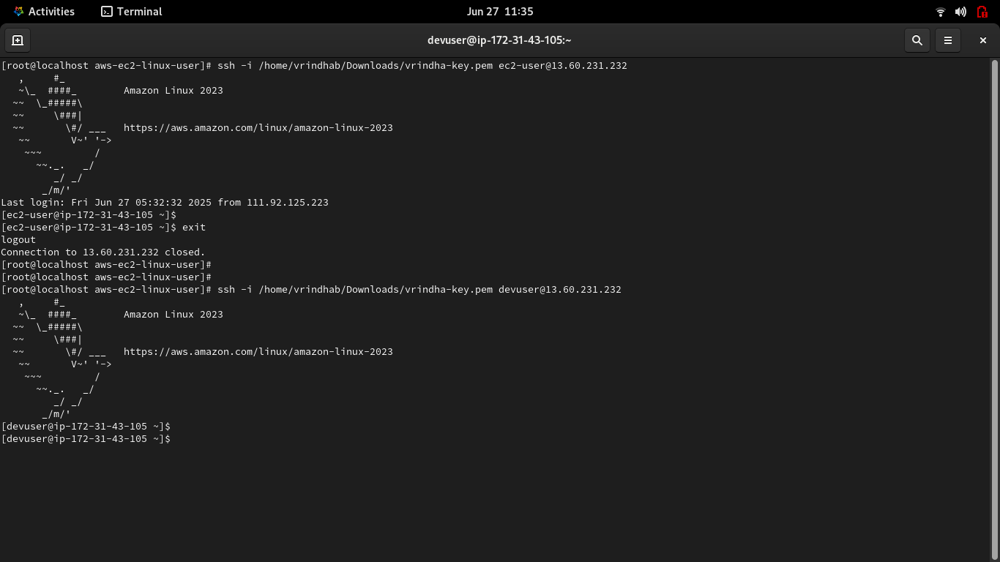
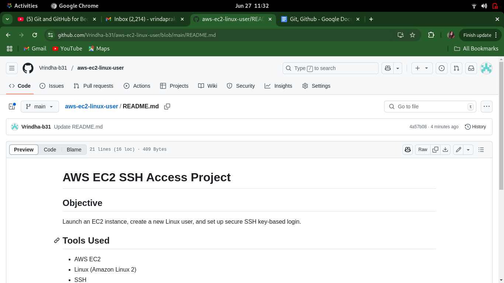

# AWS EC2 SSH Access Project

## Objective
Launch an EC2 instance, create a new Linux user, and set up secure SSH key-based login.

## Tools Used
- AWS EC2
- Linux (Amazon Linux 2)
- SSH
- Git & GitHub

## Steps Performed
1. Created EC2 with key pair
2. SSH access as `ec2-user`
3. Created Linux user `devuser`
4. Set up key-based login for `devuser`
5. Uploaded project to GitHub

## Author
Vrindha Prakash

## Screenshots

### EC2 Instance

### SSH as ec2-user and devuser

### GitHub Repo

